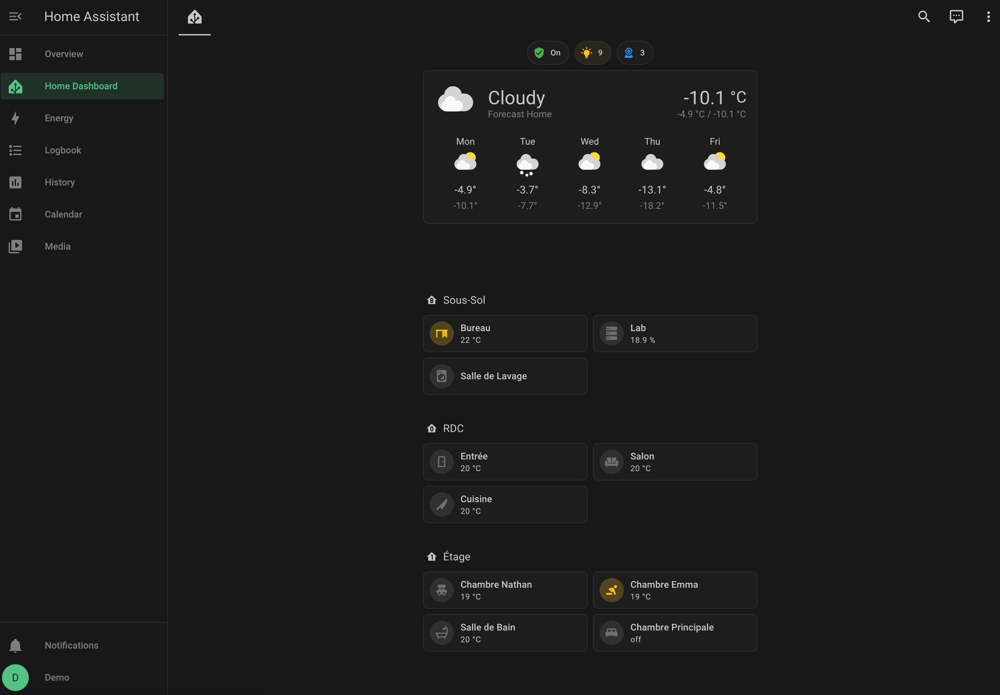
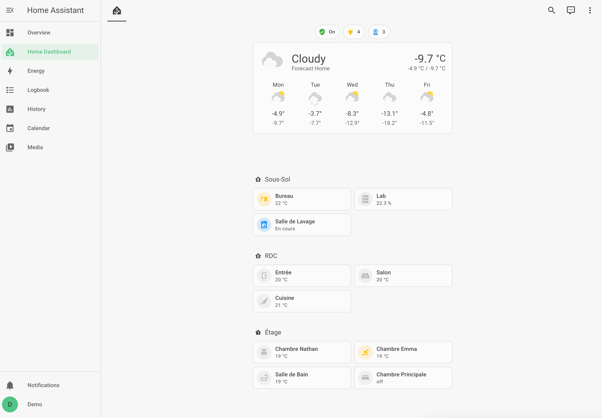

<p align="center">
	
    
</p>

## Usage

### With [HACS](https://hacs.xyz/)

1. Add the following code to your `configuration.yaml` file (reboot required).

```yaml
frontend:
  ... # your configuration.
  themes: !include_dir_merge_named themes
  ... # your configuration.
```

2. Go to the Community Store.
3. Search for `Supa Assistant`.
4. Navigate to `Supa Assistant` theme.
5. Press `Install`.
6. Go to services and trigger the `frontend.reload_themes` service.

### Manual

1. Add the following code to your `configuration.yaml` file (reboot required).

```yaml
frontend:
  ... # your configuration.
  themes: !include_dir_merge_named themes
  ... # your configuration.
```

2. Clone the repository

```bash
git clone https://github.com/regg00/supaassistant.git
```

3. Copy `themes/supaassistant.yaml` in your existing (or create it) `themes/` folder.

```bash
mv home-assistant/themes/supaassistant.yaml ~/config/themes/.
```
